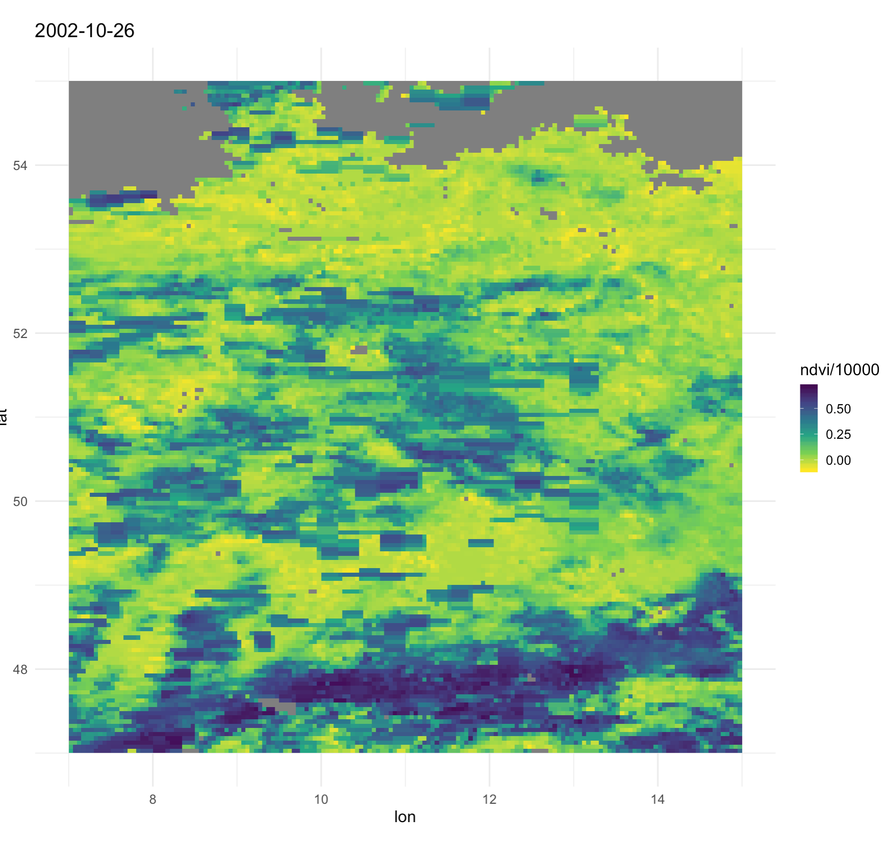

# ndvidata_r
Download and process NDVI data from www.ncei.noaa.gov
Flyer: https://www1.ncdc.noaa.gov/pub/data/sds/cdr/CDRs/Normalized%20Difference%20Vegetation%20Index/CDR_Flyer_01B-20b.pdf
```{r}
url_path <- 'https://www.ncei.noaa.gov/data/avhrr-land-normalized-difference-vegetation-index/access/'
```

## Meta
 * netcdf files (.nc)
 * resolution 0.05 degrees (3-5 km)
 * daily time step
 * ndvi value is scaled with a factor = `0.0001` (e.g. 54356 = 0.54356)
 * ` time:units = "days since 1981-01-01 00:00:00"`
 
 dimensions:
        latitude = 3600 ;
        longitude = 7200 ;
        time = 1 ;
        nv = 2 ;
        ncrs = 1 ;

## Notes

2018 is so far (2019-10-22) priliminary data.

## Example (Germany)


